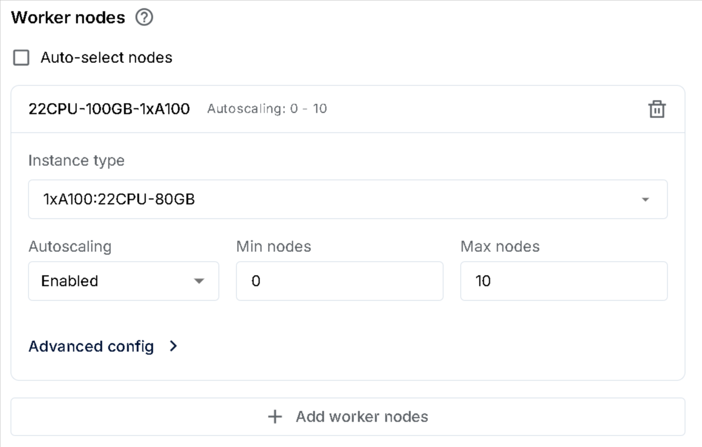
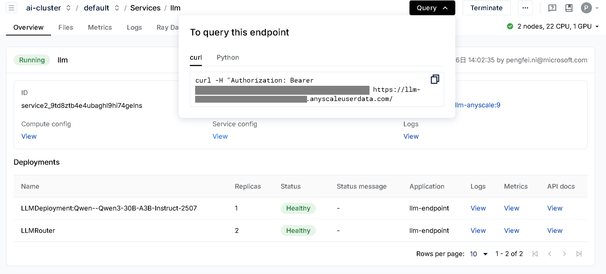

# Serving LLM with Anyscale on AKS

## Create and setup [AKS cluster](https://learn.microsoft.com/en-us/azure/aks/)

Follow Anyscale doc [here](https://github.com/anyscale/terraform-kubernetes-anyscale-foundation-modules/blob/main/examples/azure/aks-new_cluster/README.md) to create an AKS cluster and install Nvidia device plugin.

1. Setup pre-requirements:

- Install [Azure CLI](https://learn.microsoft.com/en-us/cli/azure/install-azure-cli)
- Install [terraform](https://developer.hashicorp.com/terraform/install)
- Install [helm](https://helm.sh/docs/intro/install/)
- Install [kubectl](https://kubernetes.io/docs/tasks/tools/install-kubectl-linux/)
- Install [anyscale](https://docs.anyscale.com/reference/quickstart-cli/)
  - You need Python as well to run `pip install anyscale`

2. Clone the terraform template:

```sh
git clone https://github.com/anyscale/terraform-kubernetes-anyscale-foundation-modules
cd terraform-kubernetes-anyscale-foundation-modules/examples/azure/aks-new_cluster
```

3. Customize terraform values

```sh
cat>terraform.tfvars <<EOF
azure_subscription_id = "<your-subscription-id>"
azure_location = "<region (e.g. West Europe)>"
aks_cluster_name = "<cluster-name (e.g. aks-anyscale)>"
node_group_gpu_types = ["<gpu-type (e.g. A100)>"]
EOF
```

4. Create the cluster:

```sh
terraform init
terraform plan
terraform apply -auto-approve
```

Once done, remember the region, identity ID, storage bucket name and endpoint, which would be used in later steps.

5. Install nginx ingress controller and Nvidia device plugin：

Get the AKS cluster credentials:

```sh
az aks get-credentials --resource-group <azure_resource_group_name> --name <aks_cluster_name> --overwrite-existing
```

Install nginx ingress controller:

```sh
helm repo add nginx https://kubernetes.github.io/ingress-nginx
helm upgrade ingress-nginx nginx/ingress-nginx \
  --version 4.12.1 \
  --namespace ingress-nginx \
  --values https://github.com/anyscale/terraform-kubernetes-anyscale-foundation-modules/raw/refs/heads/main/examples/azure/aks-new_cluster/sample-values_nginx.yaml \
  --create-namespace \
  --install
```

Install Nvidia device plugin：

```sh
helm repo add nvdp https://nvidia.github.io/k8s-device-plugin
helm upgrade nvdp nvdp/nvidia-device-plugin \
  --namespace nvidia-device-plugin \
  --version 0.17.1 \
  --values https://github.com/anyscale/terraform-kubernetes-anyscale-foundation-modules/raw/refs/heads/main/examples/azure/aks-new_cluster/sample-values_nvdp.yaml \
  --create-namespace \
  --install
```

## Register the Anyscale Cloud

1. Get an API key from <https://console.anyscale.com/api-keys> and set set environment variable:

```sh
export ANYSCALE_CLI_TOKEN=<api-key>
```

2. Login Anyscale CLI:

```sh
anyscale login
```

3. Register AKS cluster to the Anyscale Cloud:

```sh
anyscale cloud register \
  --name <your-name> \
  --region <your-region> \
  --provider azure \
  --compute-stack k8s \
  --cloud-storage-bucket-name '<your-bucket-name (e.g. something like azure://anyscales-blob)>' \
  --cloud-storage-bucket-endpoint '<your-bucket-endpoint (e.g. something like https://anyscalessta.blob.core.windows.net)>'
```

Remember Cloud Deployment ID from its output, which will be used in the next step.

4. Install the Anyscale Operator

Download offical helm chart values and make changes based on it:

```sh
wget https://github.com/anyscale/helm-charts/raw/refs/heads/master/charts/anyscale-operator/values.yaml
```

Make following changes:

- Under defaultInstanceTypes, add following A100 type (suppose using A100 GPU):
  ```yaml
  22CPU-100GB-1xA100:
    resources:
      CPU: 22
      GPU: 1
      memory: 80Gi
      "accelerator_type:A100": 1
  ```
- Update anyscaleCliToken, cloudDeploymentId (got from step 3 above), cloudProvider ('azure'), operatorIamIdentity (got from terraform output), workloadServiceAccountName ('anyscale-operator') in values.yaml

Then run following command to deploy the Anyscale Operator:

```sh
helm repo add anyscale https://anyscale.github.io/helm-charts
helm repo update

helm upgrade anyscale-operator anyscale/anyscale-operator \
        -f values.yaml \
        --namespace anyscale-operator \
        --create-namespace \
        -i
```

Till now, all things are done on AKS side. Next, open [Anyscale console](https://console.anyscale.com/), you'd be able to find your self-hosted cloud registered above.

## Serve LLM with Anyscale

### Build ray-llm image

As there are still dependency issues inside anyscale's official ray-llm image, you'd need to build your own image to resolve the dependency issue.

Go to [Container Images](https://console.anyscale.com/container-images), click "Build" and start building a new image. For the Dockerfile, you'd need put:

```Dockerfile
# MUST use this base version as other versions won't work yet
FROM anyscale/ray-llm:2.46.0-py311-cu124

RUN pip install --no-cache-dir azure-storage-blob azure-identity smart_open[azure] -c /home/ray/requirements_compiled.txt
```

### Serve LLM locally in your workspace

1. Create a new workspace with your newly built image.

Add worker nodes and select 22CPU-100GB-1xA100 per sample below:



Put the following contents into Instance config under "Advanced config":

```json
{
    "metadata": {
        "annotations": {
            "azure.workload.identity/proxy-sidecar-port": "8080"
        }
    },
    "spec": {
        "tolerations": [
            {
                "effect": "NoSchedule",
                "operator": "Exists",
                "key": "node.anyscale.com/capacity-type"
            },
            {
                "effect": "NoSchedule",
                "key": "nvidia.com/gpu"
            },
            {
                "effect": "NoSchedule",
                "key": "node.anyscale.com/accelerator-type"
            },
            {
                "effect": "NoSchedule",
                "key": "kubernetes.azure.com/scalesetpriority",
                "operator": "Exists"
            }
        ]
    }
}
```

Select "Auto termination" by your preference and click "Create".

Wait a while for workspace ready and goto the VS Code (which is actually VS Code Web, you can also try terminal or VS Code desktop), and open terminal.

2. Serve the LLM model locally

Run `python -m ray.serve.llm.gen_config` command to generate a new ray config and input your model ID and Huggingface token when requested. Two files would be generated by this command, and you can update their contents per your requirements.

For reference, here are the sample config (which is using Qwen3-30B-A3B-Instruct-2507 model):

File `./serve_20250805191327.yaml`:

```yaml
applications:
  - args:
      llm_configs:
        - ./model_config/Qwen--Qwen3-30B-A3B-Instruct-2507_20250805191327.yaml
    import_path: ray.serve.llm:build_openai_app
    name: llm-endpoint
    route_prefix: /
```

File `./model_config/Qwen--Qwen3-30B-A3B-Instruct-2507_20250805191327.yaml`:

```yaml
accelerator_type: A100
deployment_config: {}
engine_kwargs:
  tensor_parallel_size: 1
  max_model_len: 100000
model_loading_config:
  model_id: Qwen/Qwen3-30B-A3B-Instruct-2507
  model_source: Qwen/Qwen3-30B-A3B-Instruct-2507
runtime_env:
  env_vars:
    HF_TOKEN: <your-huggingface-token>
```

Note that `accelerator_type` is changed from `A100-40G` to `A100` as we have set `A100` earlier on deployments.

Then run the following command to serve it locally:

```sh
serve run ./serve_20250805191327.yaml --non-blocking
```

3. Invoke the local LLM

Create a python script `test.py`:

```python
from openai import OpenAI

# Initialize client
client = OpenAI(base_url="http://localhost:8000/v1", api_key="fake-key")

models = client.models.list()
for m in models:
  print(m.id)

# Basic chat completion with streaming
response = client.chat.completions.create(
    model="Qwen/Qwen3-30B-A3B-Instruct-2507",
    messages=[{"role": "user", "content": "Hello, how are you?"}],
    stream=True
)

for chunk in response:
    if chunk.choices[0].delta.content is not None:
        print(chunk.choices[0].delta.content, end="", flush=True)
```

Run it with `python test.py`. If everything works, you'd see something like below:

```sh
Qwen/Qwen3-30B-A3B-Instruct-2507
Hello! I'm doing well, thank you for asking! 😊 I'm here to help you with anything you need. How can I assist you today
```

### Deploy LLM with Anyscale service

Run `anyscale service deploy` command to deploy the LLM as Anyscale service:

```sh
anyscale service deploy -f ./serve_20250805191327.yaml -n llm
```

A new set of Nodes would be created to serve your model on AKS cluster and a public endpoint would be created. Once service is deployed, you can find your service endpoint and token on the service overview page (Click Query on the top-right):



Replace the base URL and api_key per sample below, then you can continue consume the LLM with OpenAI SDK.

```python
from openai import OpenAI

# Initialize client
client = OpenAI(base_url="https://<your-endpoint-id>.s.anyscaleuserdata.com/v1/", api_key="<your-token>")

# Other codes...
```

### Full Service spec

Actually, the service could also be deployed without running inside the workspace, refer [anyscale-service.yaml](anyscale-service.yaml) for a full service spec that could be deployed from your local machine (you'd need to replace some of your configs inside it).

## Known issues

Here are a set of known issues why deploying steps are so complicated.

### Issue 1): Missing Azure Dependencies

**Problem**: Ray Serve application deployment fails due to missing Azure Python dependencies in the container image.

**Error Details**:

```sh
ModuleNotFoundError: No module named 'azure'
ImportError: You must \`pip install smart\_open\[azure\]\` to fetch URIs in azure blob storage container.
```

### Issue 2): Port Conflict

**Problem**: Azure Workload Identity proxy (azwi-proxy) occupies port 8000, preventing Ray Serve from binding to the same port.

**Details**:

- azwi-proxy configured with `--proxy-port=8000`
- Ray Serve attempts to bind to `0.0.0.0:8000`
- Results in `RuntimeError: Failed to bind to address '0.0.0.0:8000'`

### Issue 3): 'torch.dtype' object has no attribute 'startswith'

**Problem**: ray doesn't start due to 'torch.dtype' object has no attribute 'startswith' exception.

**Details**:

```sh
ray.exceptions.ActorDiedError: The actor died because of an error raised in its creation task, ray::_EngineBackgroundProcess.__init__() (..., repr=<ray.llm._internal.serve.deployments.llm.vllm.vllm_engine._EngineBackgroundProcess object at 0x7f1f4b051c90>)
  ...
  File "/home/ray/anaconda3/lib/python3.11/site-packages/vllm/attention/selector.py", line 148, in _cached_get_attn_backend
    attention_cls = current_platform.get_attn_backend_cls(
                    ^^^^^^^^^^^^^^^^^^^^^^^^^^^^^^^^^^^^^^
  File "/home/ray/anaconda3/lib/python3.11/site-packages/vllm/platforms/cuda.py", line 271, in get_attn_backend_cls
    and kv_cache_dtype.startswith("fp8"))
        ^^^^^^^^^^^^^^^^^^^^^^^^^
AttributeError: 'torch.dtype' object has no attribute 'startswith'
```
